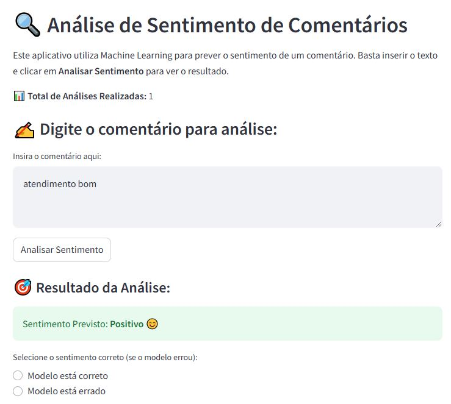
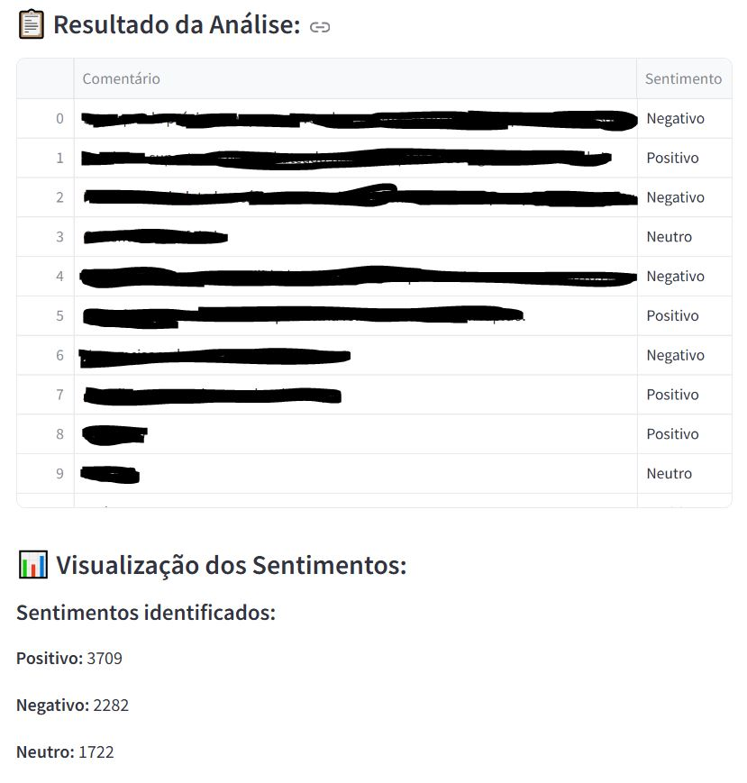
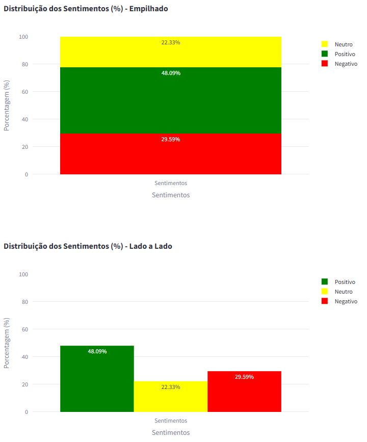
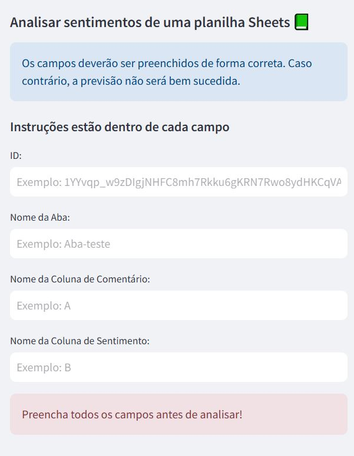
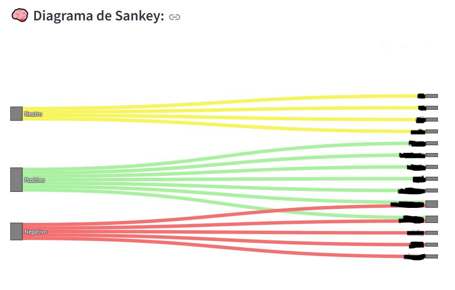

# Análise de Sentimento com Streamlit e Google Sheets

Bem-vindo ao repositório do aplicativo de Análise de Sentimento! Este projeto utiliza técnicas de Machine Learning para prever o sentimento de comentários usando um modelo Naive Bayes, treinado por uma base criada localmente e uma interface interativa desenvolvida com a plataforma de hospedagem para aplicação gratuitamente chamada Streamlit. Além disso, ele permite a análise de sentimentos em massa de comentários carregados de um arquivo CSV e visualiza os resultados em gráficos interativos.

## Funcionalidades

### 1. **Análise de Sentimento Individual**:
- **Interface Gráfica**: A página inicial permite ao usuário inserir um comentário diretamente em uma caixa de texto.
- **Previsão de Sentimento**: Ao clicar no botão "Analisar Sentimento", o modelo prevê se o sentimento do comentário é Positivo, Negativo ou Neutro.
- **Contagem de Análises**: Mantém um contador de análises realizadas durante a sessão do usuário.

**Funcionamento do primeiro input de texto para previsão isolada**

### 2. **Análise de Sentimentos em Massa**:
- **Upload de Arquivo CSV**: Permite ao usuário carregar um arquivo CSV que deve ter uma coluna chamada "Comentário".
- **Processamento em Massa**: O aplicativo lê o arquivo, aplica o modelo a cada comentário e adiciona uma nova coluna com o resultado da previsão de sentimento.
- **Gráficos Interativos**: Apresenta a distribuição dos sentimentos em gráficos de barras empilhados e lado a lado para visualização detalhada dos resultados.

**Informações gerais das previsões**

**Gráficos de %**

### 3. **Análise de Sentimentos diretamente na planilha do Google Sheets**:
- **Prevendo o sentimento de uma coluna inteira de dados**: Na aba lateral existente na aplicação, existe a possibilidade de direcionar uma coluna específica de qualquer planilha que seja para realizar a análise do sentimento do comentário em questão na mesma. A análise pode ser feita em uma alta quantidade de linhas e ainda ter um rápido tempo de execução.
- **Aba interativa**: A aba lateral é interativa, com isso pode ser oculta, evitando uma poluição visual.

**Aba lateral dentro da aplicação**

## Tecnologias Utilizadas

- **Python**: O backend do aplicativo é desenvolvido em Python, utilizando a biblioteca `pandas` para manipulação de dados e `nltk` para pré-processamento de texto.
- **Streamlit**: Framework utilizado para criar a interface interativa do usuário.
- **Modelo de Machine Learning**: Modelo Naive Bayes para previsão de sentimento, treinado e salvo em um arquivo para utilização na aplicação.
- **Autenticação Google**: A autenticação do Google foi necessário para a utilização da previsão de sentimentos em uma planilha independente.

## Ganhos em Análises e Dia a Dia de Trabalho Com a Ferramenta

### 1. **Escalabilidade**:
 - Eficiência em Processamento: A análise de grandes volumes de dados de forma eficiente permite que qualquer pessoa processe comentários, avaliações e feedbacks em massa, reduzindo o tempo e os custos necessários para análise manual.
 - Automatização: Automatizar a análise de sentimentos para grandes conjuntos de dados permite que as pessoas tomem decisões mais rápidas e fundamentadas, baseadas em tendências e insights através dos gráficos produzidos na própria aplicação.

### 2. **Melhoria na Tomada de Decisão:**:
-  Feedback de Cliente: As pessoas podem usar a análise de sentimento para interpretar feedbacks de clientes, identificando padrões em feedbacks negativos ou positivos que podem ser abordados para melhorar a experiência do cliente. Como por exemplo, nas nuvens de palavras e no diagrama de Sankey que esclarece palavras e termos que são recorrentes em um grupo de sentimentos.

### 3. **Agilidade no Dia a Dia de Trabalho**:
- Além do corte de custo necessário no tempo de análise, a ferramenta não só auxilia a pessoa que utiliza de forma situacional, mas também o analista que eventualmente pode prever os sentimentos em massa de comentários em uma planilha de seu meio de trabalho. Isso abre ainda mais o leque de opções de análises de tendências e situações com a utilização da variável "sentimento".

**Diagrama de Sankey (A aplicação também conta com nuvens de palavras para cada sentimento)**

#### **Observação**: Ao final de tudo, o arquivo CSV gerado com as previsões de sentimentos pode ser baixado!!

Sobre o projeto, é isto :)

Fique abaixo com os meus **contatos**

andrey.alves9@gmail.com | [Linkedin](https://www.linkedin.com/in/andrey-de-abreu-9a499b154/)
